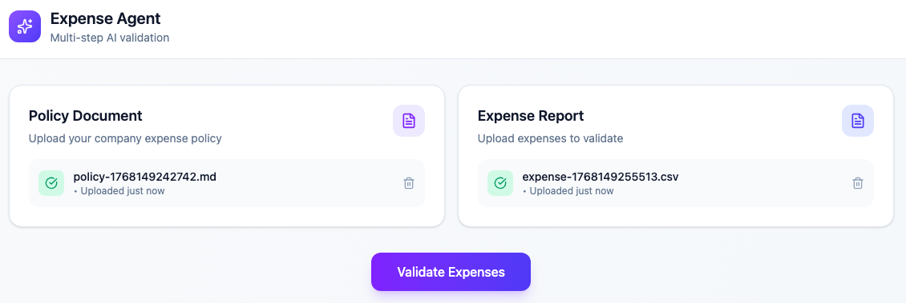
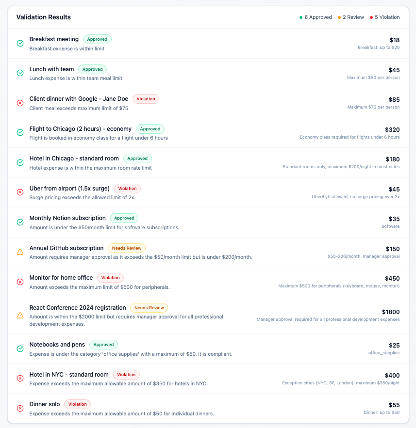
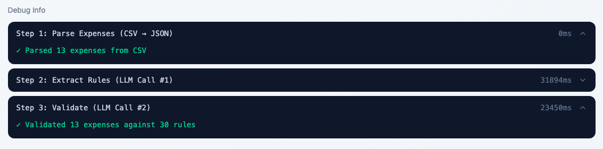
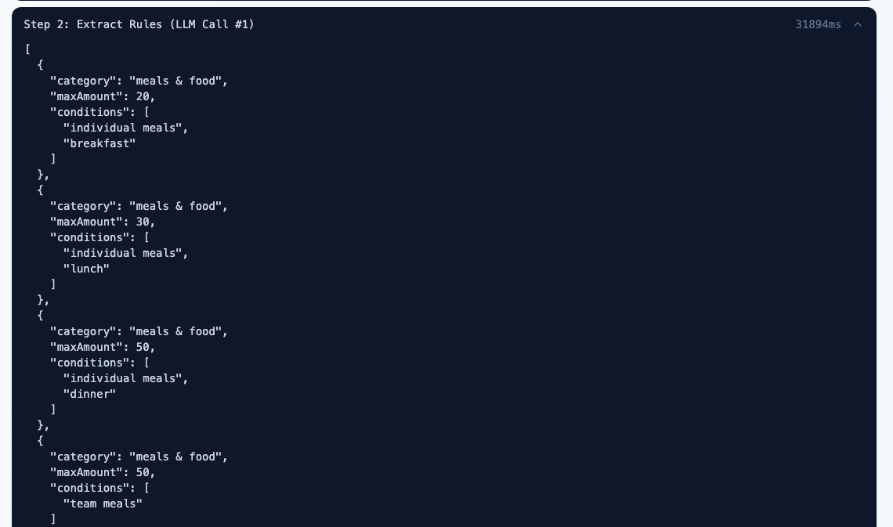

# Expense Agent

A multi-step LLM validation system that checks expense reports against company policies.

**This is a learning exercise, not production code.** The goal is to understand how chaining multiple LLM calls improves debuggability and reliability over single-call approaches.

## What It Does

Upload a company expense policy and an expense report (CSV). The system validates each expense through a three-step chain, flagging violations, approvals, and items needing review.




## The Multi-Step Chain

```
┌─────────────────┐     ┌─────────────────┐     ┌─────────────────┐
│   Step 1        │     │   Step 2        │     │   Step 3        │
│   Parse CSV     │ ──► │   Extract Rules │ ──► │   Validate      │
│   (code)        │     │   (LLM call #1) │     │   (LLM call #2) │
└─────────────────┘     └─────────────────┘     └─────────────────┘
        │                       │                       │
        ▼                       ▼                       ▼
   Expense[]              ExtractedPolicy         ValidationResult[]
```

**Step 1: Parse Expenses** — Code parses CSV into structured expense objects. No LLM needed for structured data.

**Step 2: Extract Rules** — LLM reads the policy document and extracts rules in a structured format (category limits, conditions, general rules).

**Step 3: Validate** — LLM checks each expense against the extracted rules, returning approved/needs_review/violation with reasoning.

## Why Multi-Step Instead of Single-Call?

A single LLM call would be: "Here's an expense report and a policy. Which expenses violate the policy?"

**Problems with single-call:**

- LLM has to parse two different document types simultaneously
- Easy to miss rules or misapply them
- No visibility into what rules it extracted or how it interpreted expenses
- When something's wrong, you can't tell which part failed

**Multi-step advantages:**

- Each step has one focused job
- Intermediate outputs are inspectable ("Did it understand the $50 meal limit?" — check Step 2's output)
- Validation step works with clean structured inputs, not raw documents
- When it flags something incorrectly, you can trace exactly where the error occurred

## Why This Problem Fits Multi-Step

Expense validation naturally decomposes into distinct subtasks:

1. **Extract** expenses (structured data → code)
2. **Extract** rules (natural language → LLM)
3. **Validate** expenses against rules (reasoning → LLM)

A single prompt trying to do all three is more likely to miss rules, misinterpret expenses, or produce inconsistent results. The task boundaries are clean, making it ideal for demonstrating multi-step reasoning.

## Debug View

The debug panel shows exactly what happened at each step:

- **Extracted Rules** — What the LLM understood from the policy
- **Timing** — How long each step took (parse, extract, validate)
- **Rule Applied** — Which policy rule was used for each expense decision

This transparency is the core benefit of multi-step: when validation is wrong, you can see whether Step 2 misunderstood the policy or Step 3 misapplied it.




## Key Architectural Decisions

**Why parse expenses with code, not LLM?**
Expenses are structured CSV data — predictable format, deterministic parsing. Using an LLM would be slower, cost money, and add unpredictability for no benefit.

**Why extract rules with LLM, not code?**
Policies are natural language prose. Rules like "max $50 per person for meals, receipts required over $25" need interpretation. Code can't reliably parse arbitrary policy language.

**Why batch validation in groups of 5?**
Balances API efficiency (fewer calls) with reliability (smaller context per call). One giant batch risks the LLM getting confused with too many expenses; per-expense calls are too slow and expensive.

**File uploads use Multer memory storage** — This is a learning project. In production, you'd use signed URLs with cloud storage (GCS/S3) so files upload directly to the cloud without touching your server.

## Architecture Overview

```
┌─────────────────────────────────────────────────────────────────┐
│                         Frontend (React)                        │
│              Upload policy + expenses, view results             │
└─────────────────────────────────────────────────────────────────┘
                                 │
                                 ▼
┌─────────────────────────────────────────────────────────────────┐
│                        Backend (Express)                        │
│                                                                 │
│  ┌─────────────────────────────────────────────────────────────┐│
│  │                   ValidationPipeline                        ││
│  │  Orchestrates the three-step chain, collects timing         ││
│  └─────────────────────────────────────────────────────────────┘│
│         │                    │                    │              │
│         ▼                    ▼                    ▼              │
│  ┌─────────────┐     ┌─────────────────┐   ┌────────────────┐  │
│  │ExpenseCsv   │     │PolicyRule       │   │Expense         │  │
│  │Service      │     │Extractor        │   │Validator       │  │
│  │(parse)      │     │(LLM call #1)    │   │(LLM call #2)   │  │
│  └─────────────┘     └─────────────────┘   └────────────────┘  │
│                              │                    │              │
│                              ▼                    ▼              │
│                        ┌─────────────────────────────┐          │
│                        │          OpenAI API         │          │
│                        │        (gpt-4o-mini)        │          │
│                        └─────────────────────────────┘          │
└─────────────────────────────────────────────────────────────────┘
```

## The Validation Flow

1. **Upload**: Policy document (.md, .txt) and expense report (.csv) uploaded separately
2. **Validate**: User clicks validate → pipeline runs three steps
3. **Parse**: CSV parsed into Expense[] (code, no LLM)
4. **Extract**: Policy text → LLM → ExtractedPolicy (rules + general rules)
5. **Validate**: Expenses + Rules → LLM → ValidationResult[] (status + reasoning)
6. **Display**: Results shown with debug info

## Tech Stack

| Component     | Technology              |
| ------------- | ----------------------- |
| Backend       | Express + TypeScript    |
| Frontend      | React                   |
| LLM           | OpenAI GPT-4o-mini      |
| DI            | Inversify               |
| File Handling | Multer (memory storage) |
| CSV Parsing   | PapaParse               |
